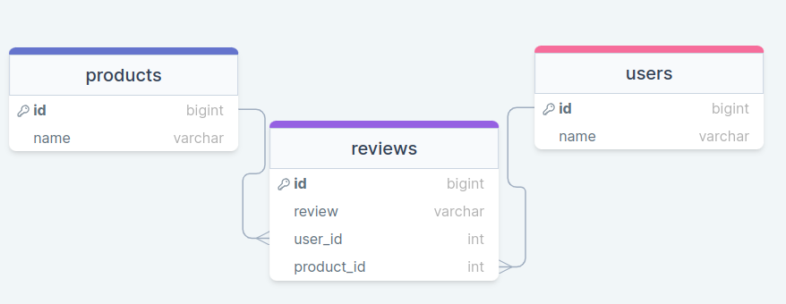

# Product Review System

## Overview

This project focuses on implementing a product review system within an e-commerce domain. The project involves three models: User, Review, and Product. A User can review multiple Products, and each Review belongs to a User and a Product.

## Table of Contents

- [Instructions](#instructions)
  - [Migrations](#migrations)
  - [Object Association Methods](#object-association-methods)
  - [Aggregate and Association Methods](#aggregate-and-association-methods)
- [Getting Started](#getting-started)
- [Usage](#usage)
- [Contributing](#contributing)
- [License](#license)

## Instructions

### Migrations

Before working on the other deliverables, create a migration for the reviews table. The reviews table should have the following columns:

- `star_rating` (integer)
- `comment` (string)
- Foreign keys to establish relationships with the User and Product tables.

After creating and running the migration, use the `seeds.rb` file to create Review instances for testing.

### Object Association Methods

Implement the following methods using Active Record association macros and query methods:

Review:

- `Review#user`: Returns the User instance for this Review.
- `Review#product`: Returns the Product instance for this Review.

Product:

- `Product#reviews`: Returns a collection of all the Reviews for the Product.
- `Product#users`: Returns a collection of all the Users who reviewed the Product.

User:

- `User#reviews`: Returns a collection of all the Reviews given by the User.
- `User#products`: Returns a collection of all the Products reviewed by the User.

Test these methods using the `rake console` command to ensure they work as expected.

### Aggregate and Association Methods

Implement the following methods:

Review:

- `Review#print_review`: Prints a string formatted as follows: "Review for {product name} by {user name}: {review star_rating}. {review comment}."

Product:

- `Product#leave_review(user, star_rating, comment)`: Creates a new Review in the database associated with this Product and the User. Takes a User instance, a star_rating (integer), and a comment (string) as arguments.
- `Product#print_all_reviews`: Prints a string representing each review for this product. Each review should be formatted as follows: "Review for {product name} by {user name}: {review star_rating}. {review comment}."
- `Product#average_rating`: Returns a float representing the average star rating for all reviews for this product.

User:

- `User#favorite_product`: Returns the product instance that has the highest star rating from this User.
- `User#remove_reviews(product)`: Removes all the User's reviews for a specific Product. This requires deleting the associated rows from the database.

Test these methods using the `rake console` command to ensure they work as expected.

## Getting Started

1. Clone this repository to your local machine.
2. Navigate to the project's root directory.
3. Run `bundle install` to install the required dependencies.

## Usage

1. Run the database migrations via `bundle exec rake db:migrate`.
2. Run the seed file to populate the database with sample data via `bundle exec rake db:seed`.
3. Start the console by running `bundle exec rake console`.
4. Test the implemented methods interactively in the console.

## Contributing

Pull requests are welcome. For major changes, please open an issue first to discuss what you would like to change.

## License

This project is licensed under the MIT License - see the [LICENSE.md](LICENSE.md) file for details.
